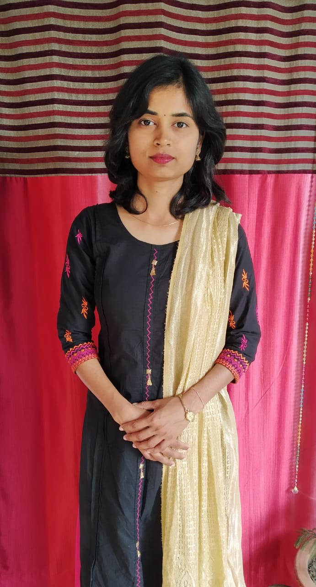

## Nisha Rani

## Fields of Interest

* Economics / Finance
* Teaching / Mentoring
* Healthcare 
* Computer Science 

## Work Experience

* **Nisha Academy** *(2016 - Present)*: 
  * **Objective**:Teaching / Mentoring students from 1st to 12th standard (CBSE Board).
  * Subjects taught:  Maths, Physics, Chemistry, Economics , English, and Social Sciences.
  * Tasks included: Daily lecture preparation and biweekly(twice a week) formulation of questions papers & homework assignments for regular evaluations of students.
  * Results After joining my academy, students scores have improved by at least 20-50 % . 
  
* **Nisha Urban Farm** *(2017 - Present)*:  
  * **Objective**: Terrace Gardening, Container Gardening for vegetables and flora (Indoor and outdoor).
  * Tasks: Seeds Procurement, Planting, Preparation of Soil, Nurturing of plants, Harvesting (When applicable).
  * Results: [Instagram: **EnviroGreen** ](https://www.instagram.com/envirogreen_/), [Blog: **Nisha Rani**](https://rnishacom.wordpress.com/)
  
  
## Position of Responsibility
* **Bharat Ranger Lead** ( 2014 - 2017):
  * Lead a team of 24 rangers for various Camps, Workshops and Activities all year round.
  * **Rover & Ranger Camp**: Lead organization and management of 5-day camp (eg. First Aid, Forest Survival Skills etc.) every year as a Ranger Lead.
  * **Lead Rover Activities**: Lead Oganization and management of various activities (Social Service, Diabetes Awareness Workshop, Weekly meetings etc.)  year as a Ranger Lead.  
* **National Seminar Volunteer Lead** (2019)
  * Lead the student volunteer team for 2-day National Seminar on Paradigm Shift in Indian Economy. 

## Education

## Academic Education 
  
|                 Degree                                                        |  Rank   |               University / Institution               |
|:-----------------------------------------------------------------------------:|:-------:|:----------------------------------------------------:|
| MA ( Economics )                                                              | 2nd Div | Deen Dayal Upadhyaya Gorakhpur University, Gorakhpur |
| BA ( Economics, English, Psychology )                                         | 1st Div | St. Andrews College, Gorakhpur.                      |
| Diploma ( Database Management System )                                        | 1st Div | St. Andrews College, Gorakhpur.                      |
| Nursery Teachers Training ( Diploma in Child Education & Applied Psychology ) | 1st Div | Air Force School, Gorakhpur                          |
| Intermediate (CBSE 12th: Maths, Physics, Chemistry )                          | 2nd Div | Kendriya Vidyalaya, GKP                              |
| High School (CBSE 10th: Maths, Science, English, Social Studies )             | 1st Div | Kendriya Vidyalaya, GKP                              |

## Healthcare Education   
  
|                Course Name              |
|:---------------------------------------:|
| Be Your own Doctor by Dr. Salila Tiwari |
|  The Super Salads Class by SHARAN India |
|      Satvic Movement by Subah Jain      |

## Achievements   
    
| Competition          | Prize | Remarks                                                                           |
|----------------------|-------|-----------------------------------------------------------------------------------|
| Debate               | 1st   | *Role of youth in eradication of corruption*. St. Andrews College (B.A)           |
| Debate               | 2nd   | *Impact of Demonisation in India*. Deen Dayal Upadhyaya University (M.A)          |
| Debate               | 2nd   | *Is India ready to be a Cashless economy?*. Deen Dayal Upadhyaya University (M.A) |
| Middle Distance Race | 1st   | 800 meters. Kendriya Vidyalaya, GKP.                                              |
| Relay Race           | 3rd   | 800 meters. Kendriya Vidyalaya, GKP.                                              |
| Sprint               | 3rd   | 100 meters. Kendriya Vidyalaya, GKP.                                              |
| Sprint               | 3rd   | 200 meters. Kendriya Vidyalaya, GKP.                                              |
| Sprint               | 2nd   | 100 meters. Kendriya Vidyalaya, GKP.                                              |
| Sprint               | 2nd   | 400 meters. Kendriya Vidyalaya, GKP.                                              |
| Sprint               | 1st   | 100 meters. Kendriya Vidyalaya, GKP.                                              |
| Sprint               | 2nd   | 400 meters. Kendriya Vidyalaya, GKP.                                              |
| Ball Relay Race      | 2nd   | 400 meters. Kendriya Vidyalaya, GKP.                                              |
| Group Song           | 2nd   | Kendriya Vidyalaya, GKP.                                                          |

## Volunteer Work

* **Smile Roti Bank ( NGO )**  *(2017-Present)*:  Smile Roti Bank is a ~14 Years old NGO focussed on enabling underpriviledged kids with education, food and shelter. 
  * My association with the NGO has been in the form of teaching and contribution in the form of stationary, clothes etc. which can be of aid to underprivileged kids.

## Skills

* **Technical Skills**:
  * Computer Skills: Python Programming, Web Development ( HTML, CSS, Javascript ), Databases (SQL).
  * Platforms: Linux (Ubuntu), Windows
* **Soft Skills**:
  * Active Listening, Leadership, Interpersonal communication skill, Management skills.

## Hobbies / Non-Academic Interests

* **Urban Farming**: To grow organic fruits, vegetables and other flora in an urban setting to meet the need of food, and ambience of the home. Some details regarding "Nisha Urban Farm" is as below:
  * Fruits ( Banana, Strawberry, Guava, Lemon, Lychee, Mango )
  * Vegetable ( Bottle gourd or Lauki, Beans, Spinach, Cauliflower, Cabbage,Tomato etc.)
  * Herbs: Mint, Ashwagandha, Giloy
  * Flowers ( ~15-20 variety )
  * Indoor Plants: Air-purifier Plants and show plants ( ~15-20 variety )
* **Cooking**: To prepare food which is nutritious and good on the palate.
  * Superfoods: Sprouts (Lentil sprounts, Vegetable Sprouts)
  * Sabji: North, South indian dishes and Satvic Sabji (~10 different variety). 
  * Rotis / Parathas: Plain, Beetroot & Spinach Roti. Muli Paratha, Gobhi Paratha.
  * Rice: Plain Rice, Jeera Rice, Pulao.
  * Desert: Kulfi, Kheer, Seviyan. 
  * Cake: Vanilla, Chocholate.
* **Travelling**: To explore countryside more than urban dwellings.
  * Mount Abu, Jammu, Bangalore, Mumbai, Gorakhpur.
* **Yoga**: To achieve balance within body.
  * Asana (Intermediate Practitioner)
  * Pranayam (Intermediate Practitioner)
* **Meditation**: To achieve balance of mind.
  * Mindfulness (Beginner)
  * Vipassana (Beginner)
* **Photography** (Intermediate): To cature beautiful and interesting moments in life.
  * Capturing interesting moments in a frame while exploring this world through my hobbies.
  
## Family Details
 
* **Father:  Shri. Tarkeshwar Sharma** 
  * Indian Air Force : Radio Communication Engineer / Retired (Ex-Servicemen)
  * Education: 
    * B.Sc(Hons) Physics
    * Diploma in Electronics Radio and Communication Engineering / Indian Air Force 

* **Mother: Smt. Manju Sharma**
  * BA (Geography) / Deen Dayal Upadhyaya Gorakhpur University, Gorakhpur
  * Nursery Teacher Training(NTT) Graduate (2 years course) 
  * Air Force Wives Welfare Association (AFWWA): Maintaining Administrative, Logistics aspects for ~20 years, Awarded 4 times by Station Commander of Air Force Station GKP for exemplary contribution.

* **Brother (Eldest): Prashant K. Sharma**
  * Artificial Intelligence Researcher at Hitachi Central Laboratory, Tokyo, Japan.
  * M.Tech (Research Assistant) in Computer Science and Engineering, IIT Bombay, India.
  * B.Tech, Computer Science and Engineering, KNIT Sultanpur (Govt. College, U.P.)

* **Sister (Youngest): Priyanka Sharma**
  * B.Tech, Computer Science and Engineering, KNIT Sultanpur (Govt. College, U.P.)

### NOTE: 
The sample videos/pictures of my gardening, cooking, travelling, etc. will be linked soon to this page.

